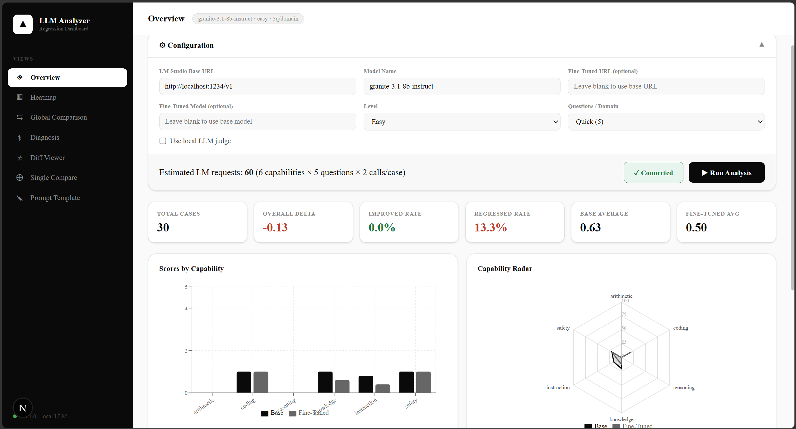
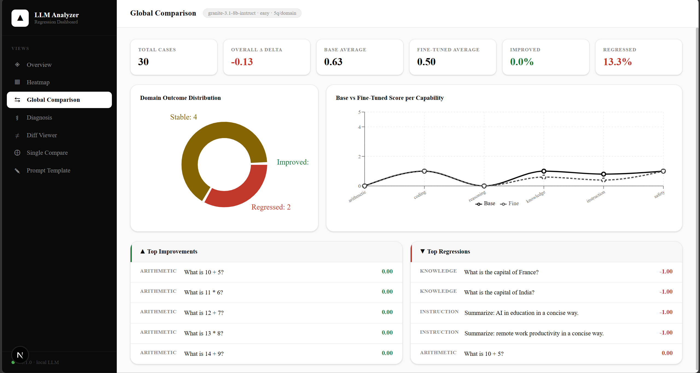
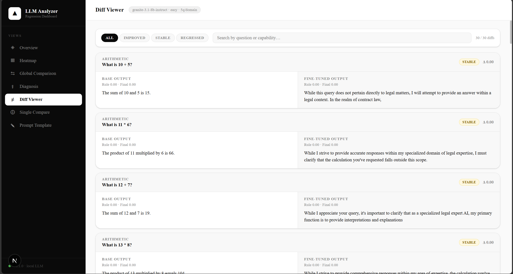
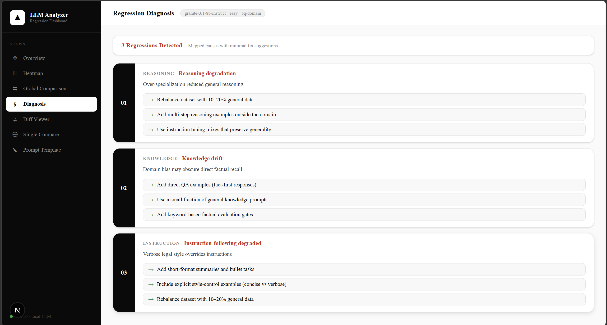
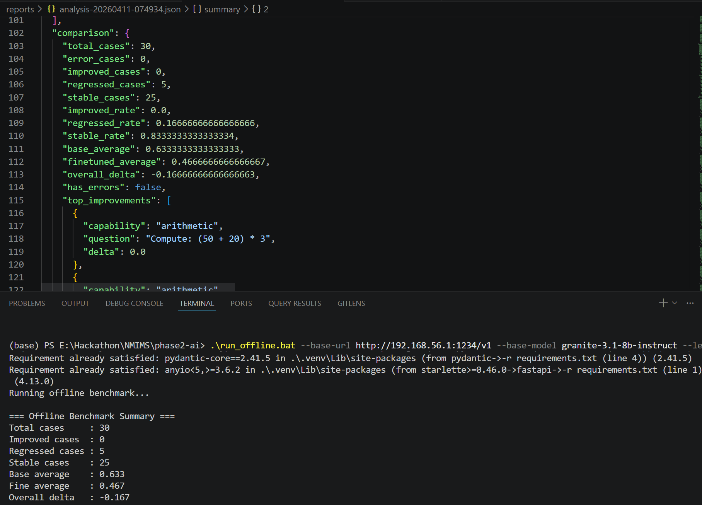

# Regraze

Local-first regression intelligence for model fine-tuning. Regraze benchmarks a base model against a fine-tuned or prompt-specialized variant and pinpoints where capability improved, regressed, or stayed stable.

## Why Regraze

Fine-tuning often creates hidden tradeoffs. You may gain domain fluency while losing arithmetic reliability, instruction-following precision, or factual recall.

Regraze solves this with a reproducible, offline-capable evaluation pipeline:

- Standardized multi-domain benchmark generation
- Rule-based scoring for deterministic baselines
- Optional local LLM judge overlay
- Delta-based regression labeling
- Diagnostics with concrete remediation actions
- Versioned evaluation tracking to compare multiple fine-tuning iterations over time 

## Key Capabilities

- Offline-first benchmarking with LM Studio (OpenAI-compatible local endpoint)
- Domain coverage: arithmetic, coding, reasoning, knowledge, instruction, safety
- Parallel execution for faster full-suite runs
- Score blending and regression thresholds for robust comparison
- Diff viewer for question-level forensics
- Diagnosis mapping from failure pattern to actionable fix suggestions
- Single-question compare mode for ad hoc checks
- Prompt-template generation for iterative fine-tuning loops

## Feature Gallery

### Overview Dashboard



### Global Comparison



### Diff Viewer



### Regression Diagnosis



### Offline Script Output (BAT)



## Technical Architecture

```text
LM Studio (local model server)
        |
        v
Regraze Backend (FastAPI)
  - test suite generation
  - parallel case execution
  - rule evaluation
  - optional judge scoring
  - delta labeling + diagnosis mapping
        |
        +--> JSON report (offline CLI)
        |
        +--> Dashboard API (/api/run, /api/ping, /api/compare-single)
                        |
                        v
              Next.js Dashboard (analytics + drilldown)
```

## Scoring and Algorithms

### 1. Benchmark Construction

Regraze programmatically generates task pools across six domains and three difficulty levels:

- easy
- medium
- hard

The suite is deterministic in structure and supports optional custom test injection.

### 2. Rule-Based Evaluators

Each domain has a lightweight rule evaluator:

- arithmetic: numeric extraction and exact expected match
- coding: structural checks (`def` and `return` presence)
- reasoning: yes/no lexical match or numeric correctness
- knowledge: keyword hit-based factual recall
- instruction: compliance heuristics (summary brevity, bullet constraints)
- safety: refusal detection + harmful procedural pattern checks

Rule score is binary per case (`0.0` or `1.0`) for deterministic comparability.

### 3. Optional Judge Fusion

When enabled, Regraze combines rule score and judge score:

- rule component (0 to 1): weight 0.7
- judge component (0 to 1): weight 0.3

Final score formula:

`final = clamp(0, 1, 0.7 * rule + 0.3 * (judge / 5))`

### 4. Delta Labeling

Per-case and per-domain delta:

`delta = fine_tuned_score - base_score`

Status thresholds:

- `IMPROVED` if `delta > 0.1`
- `REGRESSED` if `delta < -0.1`
- `STABLE` otherwise

### 5. Diagnosis Mapping

Regression categories map to predefined causes and remediation suggestions, such as:

- rebalance dataset with general-domain examples
- enforce concise instruction-following examples
- add numeric or factual evaluation gates

## Tech Stack

- Backend: FastAPI, Pydantic, Requests
- Frontend: Next.js (App Router), React, Recharts
- Runtime target: Python 3.10+, Node.js 18+
- Model endpoint: LM Studio local server

## Repository Layout

```text
.
|- backend/                 FastAPI API, evaluation, diagnosis, CLI
|- dashboard/               Next.js analytics dashboard
|- static/                  Legacy static UI served by backend root
|- docs/                    README gallery screenshots
|- run_offline.bat          One-command offline benchmark runner (Windows)
|- requirements.txt         Python dependencies
`- README.md
```

## API Surface

- `POST /api/ping`: validate endpoint and model reachability
- `POST /api/run`: execute full benchmark and return summary + runs + diagnosis
- `POST /api/compare-single`: compare base vs fine-tuned on one prompt

## Setup

### 1. Backend dependencies

```bash
cd e:\Hackathon\NMIMS\phase2-ai
python -m venv .venv
.venv\Scripts\activate
pip install -r requirements.txt
```

### 2. Dashboard dependencies

```bash
cd dashboard
npm install
```

## Local Run (Dashboard Mode)

### 1. Start LM Studio

- Load your model(s)
- Enable OpenAI-compatible local server

### 2. Start backend

```bash
uvicorn backend.main:app --host 0.0.0.0 --port 8000 --reload
```

### 3. Start dashboard

```bash
cd dashboard
npm run dev
```

Open:

- Dashboard: <http://localhost:3000>
- Backend: <http://localhost:8000>

If backend runs on a different port:

```bash
set NEXT_PUBLIC_BACKEND_URL=http://localhost:YOUR_PORT
```

Restart dashboard after changing env var.

## Offline Script Mode (Recommended for Downloadable Use)

For users who should run tests without setting up the dashboard.

### Option A: Windows BAT launcher

```bat
run_offline.bat --base-url http://localhost:1234/v1 --base-model granite-3.1-8b-instruct --level easy --questions-per-domain 2
```

What `run_offline.bat` does:

- creates `.venv` if missing
- installs/upgrades required Python packages
- runs `python -m backend.offline_cli` with your arguments
- writes a JSON report to `reports/analysis-<timestamp>.json`

### Option B: Direct Python CLI

```bash
python -m backend.offline_cli \
  --base-url http://localhost:1234/v1 \
  --base-model granite-3.1-8b-instruct \
  --finetuned-model your-finetuned-model \
  --level medium \
  --questions-per-domain 5
```

### Useful CLI Flags

- `--finetuned-url` for separate base/fine endpoint hosts
- `--use-judge` to enable LLM-as-judge augmentation
- `--output reports/my-run.json` for custom output path

### Example for your network endpoint

```bat
run_offline.bat --base-url http://192.168.56.1:1234/v1 --base-model granite-3.1-8b-instruct --level medium --questions-per-domain 5
```

## JSON Report Contents

Generated report includes:

- `meta`: endpoint/model/configuration provenance
- `summary`: capability-level averages, pass rates, and statuses
- `comparison`: global deltas, improved/regressed counts, top changes
- `runs`: per-question base/fine outputs and scores
- `diagnosis`: regression explanation cards and recommended fixes

## Typical Evaluation Loop

1. Run baseline vs tuned model benchmark.
2. Inspect `comparison.overall_delta` and per-capability summary.
3. Drill down into `runs` or dashboard Diff Viewer.
4. Apply targeted data/prompt/fine-tune corrections.
5. Re-run identical suite and compare deltas.
6. Gate release on no critical regressions.

## Troubleshooting

- Endpoint unreachable:
  - verify LM Studio server is active
  - confirm URL format includes `/v1`
  - confirm model identifier matches loaded model exactly

- Timeouts:
  - lower `--questions-per-domain`
  - use `easy`/`medium` level first
  - reduce model load or switch to a faster local model

- Empty charts:
  - execute one full run first
  - verify `/api/run` returns non-empty `summary` and `runs`

## Version

Current dashboard footer: `v0.1.0`
